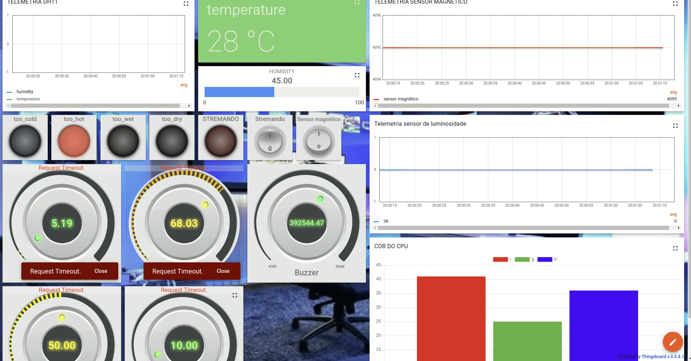

# Trabalho Final - Fundamentos de Sistemas Embarcados

| Matrícula  |        Aluno           |
| ---------- | ---------------------- |
| 18/0074741 | Caio Martins           |
| 18/0103580 | Jonathan Jorge         |
| 19/0048760 | Wellington Jonathan   |

Neste repositório consta o código do [trabalho final](https://gitlab.com/fse_fga/trabalhos-2022_2/trabalho-final-2022-2) que consiste em um sistema para controle de um quarto gamer.

Esse projeto se conecta com um servidor Thingsboard utilizando MQTT e envia informações de telemetria, incluindo dados de temperatura em graus Celsius, umidade relativa, luminosidade e o estado de botões, encoders, e sensor magnetico do kit de desenvolvimento. Além disso, ele também envia informações de alerta como atributos, incluindo alertas de temperatura alta, temperatura baixa, umidade alta e umidade baixa. Também foi utilizado o NVS Flash e o modo Low Power com light sleep para garantir melhor funcionamento do trabalho.

# Hardware

O hardware para esse repositório possui 3 ESPS32, com diferentes entradas e saídas expostas abaixo:

### ESP1

- Encoder rotativo com botão no eixo (CLK -> D5, DT -> D18, SW -> D19)
- Sensor de luminosidade (ADC1 CHANNEL 0)

### ESP 2

- LED (GPIO 22)
- Botão (GPIO 5)
- Sensor magnético saida analógica (ADC_CHANNEL_6)
- Sensor magnético saida digital (GPIO 23)
- LED placa (GPIO 2)

### ESP 3

- DHT11 (GPIO 26)
- Buzzer (GPIO 33)
- LED RGB (GPIO 17, GPIO 18, GPIO 19)
- LED placa (GPIO 2)

Mais informações sobre a esp03 podem ser encontradas [aqui](esp03/README.md).

# Dependências

[Visual Studio Code](https://code.visualstudio.com/)

[ESP-IDF](https://docs.espressif.com/projects/esp-idf/en/v5.0/esp32/get-started/index.html)

[Thingsboard](https://thingsboard.io/)

## Opções dos Kconfigs

As seguintes opções podem ser configuradas usando-se o `menuconfig`:

##### Menu "Project's Wifi Configuration"

- `ESP_WIFI_SSID`, o SSID da rede usada para se conectar à Internet
- `ESP_WIFI_PASSWORD`, a senha da rede
- `ESP_MAXIMUM_RETRY`, número máximo de tentativas de conexão

##### Menu "MQTT Configuration"

- `MQTT_SERVER_URI`, o endereço usado para se conectar ao intermediário
(*broker*) MQTT usado pelo Thingsboard
- `MQTT_USERNAME`, o *token* usado para se comunicar com o *broker* MQTT do
Thingsboard

##### Menu "Operation Mode"

- `BATTERY_MODE`, caso marcada, o microcontrolador entrará no modo *Light Sleep*
periodicamente (entre 10 e 20 segundos). É possível retirá-lo do modo de
suspensão ativando o botão da placa.

# Como rodar

Para rodar o projeto, é necessário executar os seguintes comandos para cada ESP:

1. Configure o projeto

	`idf.py menuconfig`

2. Compile os códigos-fonte

	`idf.py build`

3. Grave o resultado na memória *flash* da ESP32

	`idf.py flash`

4. Execute e monitore

	`idf.py monitor`

# Dashboard

Abaixo está um gif da dashboard do Thingsboard com os dados enviados pelo projeto.

